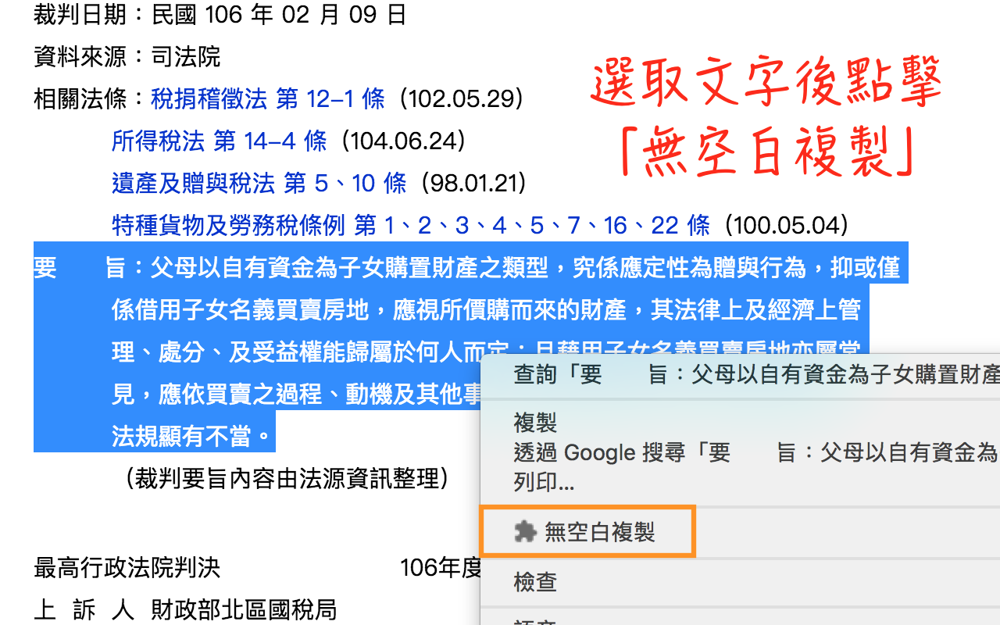
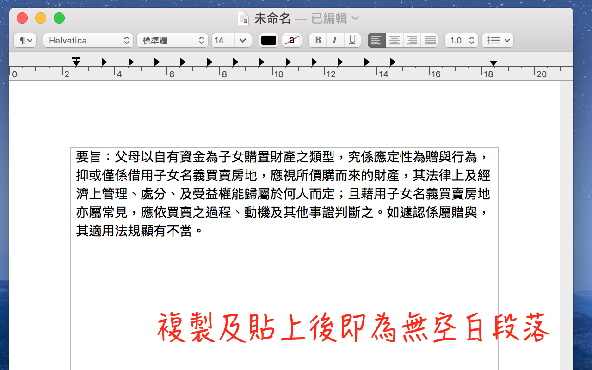

# 司法文書重排版 Chrome擴充套件

## 功能介紹

此為[司法文書重排版](https://github.com/lisez/rejdoc)之Chrome擴充套件。將司法院文書系統產生格式重新調整，並直接轉換成純文字檔案供使用者下載。

目前支援確定支援但不只以下網站：

- 司法院網站
- 法源資料庫
- Lawsnote七法

## 使用方式

- 有選取文字時**「無空白複製」**：將文字內所有空白移除，並複製
- 沒有選取文字時**「司法文書重排版」**：將頁面內文自動轉換成純文字檔案供使用者下載**（注意：請在文書內容處點擊右鍵，避免判斷失敗）**

## 套件下載

- Chrome擴充功能：[Chrome WebApp Store](https://chrome.google.com/webstore/detail/%E5%8F%B8%E6%B3%95%E6%96%87%E6%9B%B8%E9%87%8D%E6%8E%92%E7%89%88/eegidpmlcbalnjfgklfhblhjfhhljecb?hl=zh-TW)

## 更新日誌

### v1.30

- 更新函式庫至1.3版本

### v1.20

- 更新函式庫至1.1版本

### v1.11

新增：「無空白複製」。選取文字自動移除空白並複製。因為Chrome瀏覽器天生限制，選取文字時即為純文字狀態，無法進行排版，只能達到移除空白效果。

